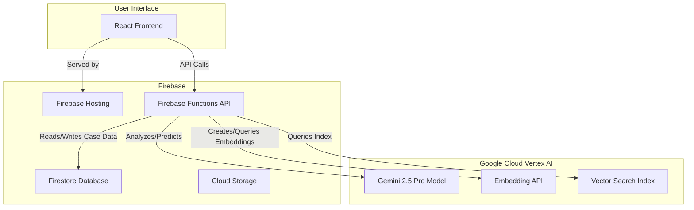
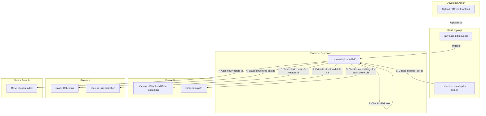

# LegalTech Predictor: The Definitive Project Blueprint

## 1. Project Overview

This document outlines the complete architectural and development plan for the **LegalTech Predictor**, a sophisticated system designed to assist trademark lawyers by analyzing and predicting the outcomes of UK/EU trademark opposition cases.

The system will leverage Google's Gemini 2.5 Pro via Vertex AI to perform a multi-faceted, sequential analysis that mirrors established legal reasoning:
1.  **Mark Similarity:** Assess visual, aural, and conceptual similarity of the trademarks in isolation.
2.  **Goods & Services (G&S) Similarity:** Evaluate the similarity of G&S, factoring in the context of the mark similarity.
3.  **Outcome Prediction:** Aggregate the analyses to predict the overall likelihood of confusion and the case outcome.

A core feature will be the ability to retrieve similar precedent cases from a purpose-built database, powered by vector search.

## 2. Core Features

The system's functionality will be exposed through a modular set of API endpoints:

*   **/mark\_similarity**:
    *   **Input**: Two wordmarks.
    *   **Analysis**:
        *   **Visual**: Levenshtein distance.
        *   **Aural**: Double Metaphone phonetic encoding followed by Levenshtein distance.
        *   **Conceptual**: Semantic similarity assessed by the Gemini LLM.
    *   **Output**: A detailed breakdown of each similarity score and a global assessment based on UK/EU trademark principles.

*   **/gs\_similarity**:
    *   **Input**: A pair of applicant and opponent G&S terms, plus the context of the overall mark similarity.
    *   **Analysis**: Assesses similarity, competitiveness, and complementarity, determining the likelihood and type (direct/indirect) of confusion for that specific pair.
    *   **Output**: A detailed similarity report for the G&S pair.

*   **/case\_prediction**:
    *   **Input**: The complete case details (marks, all G&S pairs).
    *   **Analysis**: Aggregates the mark and G&S similarity scores to predict the final opposition outcome.
    *   **Output**: A final prediction (successful, partially successful, unsuccessful), a confidence score, and detailed reasoning.

*   **Similar Case Retrieval**:
    *   **Functionality**: After a prediction, the system will perform a vector search to find and display the most relevant precedent cases from our database.
    *   **Output**: A list of similar cases, with links to download the original case PDFs.

## 3. Technology Stack

*   **Frontend**: React, TypeScript, Vite
*   **Backend**: Firebase Functions (Python)
*   **Database**: Firestore
*   **File Storage**: Cloud Storage for Firebase
*   **AI/ML**:
    *   **LLM**: Google Vertex AI - Gemini 2.5 Pro
    *   **Embeddings**: Google Vertex AI - `gemini-embedding-001` (3072 dimensions)
    *   **Vector Search**: Vertex AI Vector Search

## 4. System Architecture

## 5. Data Architecture & Pipeline

The integrity of our predictive model and search capabilities depends entirely on a robust data pipeline.

### 5.1. Data Flow Diagram

### 5.2. PDF Chunking Strategy

To ensure the vector search for precedents is highly relevant, we will employ a **Hybrid Structural & Semantic Chunking Strategy**.

1.  **Primary Structural Split**: The pipeline will first parse the PDF and split it into major logical sections based on common legal document headings (e.g., "Background & Pleadings", "Comparison of the goods and services", "Likelihood of confusion", "Decision"). This preserves the high-level context of each chunk.
2.  **Secondary Recursive Split**: Within each major section, a recursive character splitter will be used to break the text down into smaller, paragraph-aware chunks. This process will prioritize splitting by paragraph (`\n\n`), then by sentence, ensuring that individual sentences and arguments are not broken apart.
3.  **Metadata Enrichment**: Each chunk will be stored in a `Chunks` sub-collection within its parent case document in Firestore. Crucially, each chunk will be enriched with the following metadata to provide context for search results:
    *   `case_reference`
    *   `source_section` (e.g., "Likelihood of confusion")
    *   `page_number`
    *   `chunk_sequence_id`

### 5.3. Structured Data Schema

The core data extraction from PDFs will be governed by a strict JSON schema, which will be passed to the Gemini model to ensure a structured, predictable output. The definitive schema is located at `data/response_schema.json`.

## 6. Development Plan: Phases & Tasks

This project will be executed in a series of focused phases.

### Phase 1: Foundation & Data Pipeline
*Goal: Establish the project infrastructure and build the complete data ingestion and processing workflow.*

*   **Task 1**: Set up and configure the Firebase project (Firestore, Functions, Storage).
*   **Task 2**: Implement the developer-facing PDF upload interface in the React frontend.
*   **Task 3**: Create the `processUploadedPdf` Cloud Function, triggered by uploads to the `raw-case-pdfs` bucket.
*   **Task 4**: Implement the Gemini data extraction logic within the function, using the prompts from `data/prompts/` and the schema from `data/response_schema.json`.
*   **Task 5**: Implement the Hybrid Chunking Strategy.
*   **Task 6**: Implement the embedding generation process using the `gemini-embedding-001` model.
*   **Task 7**: Set up the Vertex AI Vector Search index and implement the logic to populate it.
*   **Task 8**: Thoroughly test the entire pipeline with a batch of sample PDFs.

### Phase 2: Core API Implementation
*Goal: Build the three core backend API endpoints that will power the application's analytical features.*

*   **Task 9**: Design and implement the `/mark_similarity` API endpoint.
*   **Task 10**: Design and implement the `/gs_similarity` API endpoint.
*   **Task 11**: Design and implement the `/case_prediction` API endpoint.
*   **Task 12**: Write unit and integration tests for each API endpoint.

### Phase 3: Frontend Development & Integration
*Goal: Create the user interface that allows lawyers to interact with the system and view results.*

*   **Task 13**: Develop the main React components for case data input.
*   **Task 14**: Integrate the frontend with the three core API endpoints.
*   **Task 15**: Design and build the results display, showing the prediction, confidence score, and detailed reasoning.
*   **Task 16**: Implement the similar-case search feature, querying the Vector Search index and displaying the results with links to the source PDFs.

### Phase 4: Testing, Deployment & Handoff
*Goal: Ensure the system is robust, reliable, and ready for use.*

*   **Task 17**: Conduct comprehensive end-to-end testing of the full application workflow.
*   **Task 18**: Deploy the React frontend to Firebase Hosting and the backend functions to Firebase Functions.
*   **Task 19**: Prepare final documentation and handoff materials.

## 7. Next Steps

With this definitive plan in place, the next step is to begin **Phase 1: Foundation & Data Pipeline**. This will require switching to a **Code** or **DevOps** mode to start the hands-on implementation of the Firebase environment and the data processing functions.